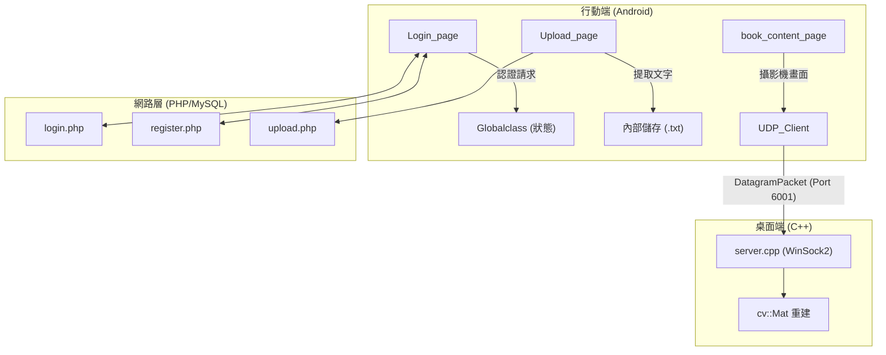

# 視線追蹤閱讀系統

一個整合 Android 電子學習與監控系統的畢業專案，結合 PDF 文字提取、互動式閱讀功能和即時電腦視覺技術來追蹤使用者的專注度。

## 🎯 專案概述

本系統允許使用者上傳 PDF 文件，並將其轉換為互動式閱讀材料。在閱讀過程中，系統會使用裝置的前置攝影機透過 OpenCV 進行人臉檢測，並將數據串流到遠端伺服器以進行監控或進一步分析讀者的注意力狀況。 [1](#0-0) 

## 🏗️ 系統架構



## ✨ 主要功能

### 📱 Android 應用程式
- **使用者認證**：支援標準電子郵件/密碼登入和 Google 登入 [2](#0-1) 
- **文件管理**：使用 `iTextPDF` 從 URI 選取的 PDF 檔案提取文字並儲存為本地 `.txt` 檔案 [3](#0-2) 
- **數據視覺化**：整合 `MPAndroidChart` 進行閱讀分析 [4](#0-3) 

### 👁️ 電腦視覺與串流
- 使用 OpenCV 進行本地處理和遠端監控
- `book_content_page` 整合 `CameraBridgeViewBase` 擷取畫面
- `UDP_Client` 處理座標或原始資料傳輸到桌面環境 [5](#0-4) 

## 🛠️ 技術棧

### Android 端
- **語言**：Java
- **框架**：Android SDK
- **核心函式庫**：
  - `com.itextpdf:itextpdf` - PDF 處理
  - `com.github.PhilJay:MPAndroidChart` - 圖表繪製
  - `com.github.bumptech.glide:glide` - 圖片載入
  - OpenCV Android SDK - 電腦視覺 [6](#0-5) 

### 後端
- **語言**：PHP
- **資料庫**：MySQL
- **功能**：使用者生命週期管理（登入/註冊）和數據同步 [7](#0-6) 

### 桌面端
- **語言**：C++
- **函式庫**：WinSock2, OpenCV
- **功能**：接收並重建 UDP 視訊串流 [8](#0-7) 

## 📁 專案結構

```
CGU_graduated_final/
├── MyApplication/                 # Android 應用程式
│   ├── app/
│   │   ├── src/main/
│   │   │   ├── java/             # Java 原始碼
│   │   │   ├── res/              # 資源檔案
│   │   │   └── AndroidManifest.xml
│   │   └── build.gradle          # 應用程式建置配置
│   └── OpenCV/                   # OpenCV Android SDK
├── server.cpp                    # Windows 桌面伺服器
├── client.cpp                    # C++ 用戶端
└── DIAGRAMS/                     # 系統設計圖
```

## 🚀 快速開始

### 前置需求
- Android Studio (最新版本)
- Android SDK (API 21+)
- OpenCV Android SDK
- PHP 7.0+ 伺服器環境
- MySQL 資料庫
- Windows 10+ (用於桌面伺服器)

### 安裝步驟

1. **克隆專案**
   ```bash
   git clone https://github.com/max01218/CGU_graduated_final.git
   ```

2. **設定 Android 應用程式**
   - 使用 Android Studio 開啟 `MyApplication` 資料夾
   - 設定 OpenCV 模組路徑
   - 同步 Gradle 專案

3. **設定 PHP 後端**
   - 部署 PHP 檔案到伺服器
   - 建立 MySQL 資料庫
   - 配置資料庫連線

4. **編譯桌面伺服器**
   ```bash
   g++ server.cpp -o server -lws2_32 -lopencv_core -lopencv_imgproc -lopencv_highgui
   ```

## 📋 權限需求

應用程式需要以下權限才能正常運作： [9](#0-8) 

- `INTERNET` - 網路連線
- `CAMERA` - 攝影機存取
- `READ_EXTERNAL_STORAGE` - 讀取外部儲存

## 🤝 貢獻

歡迎提交 Issue 和 Pull Request 來改善這個專案。

## 📄 授權

本專案使用 BSD 2-clause "Simplified" 授權條款。詳細內容請參考 [LICENSE](LICENSE) 檔案。

## 📞 聯絡方式

如有任何問題，請透過以下方式聯絡：
- GitHub Issues: [max01218/CGU_graduated_final](https://github.com/max01218/CGU_graduated_final/issues)

---

## Notes

這個 README 是基於專案的 Project Overview wiki 頁面和相關程式碼檔案生成的。專案包含三個主要層級：Android 用戶端、PHP 後端和 Windows 桌面伺服器，形成一個完整的分散式學習監控系統。系統特別整合了電腦視覺技術來追蹤使用者的閱讀專注度，這是專案的核心創新點。

Wiki pages you might want to explore:
- [Project Overview (max01218/CGU_graduated_final)](/wiki/max01218/CGU_graduated_final#1)

### Citations
